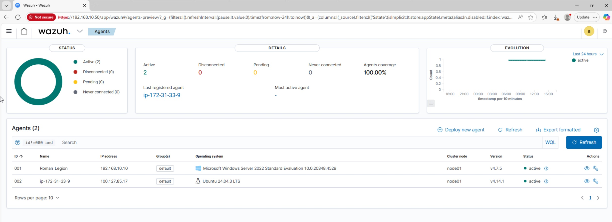
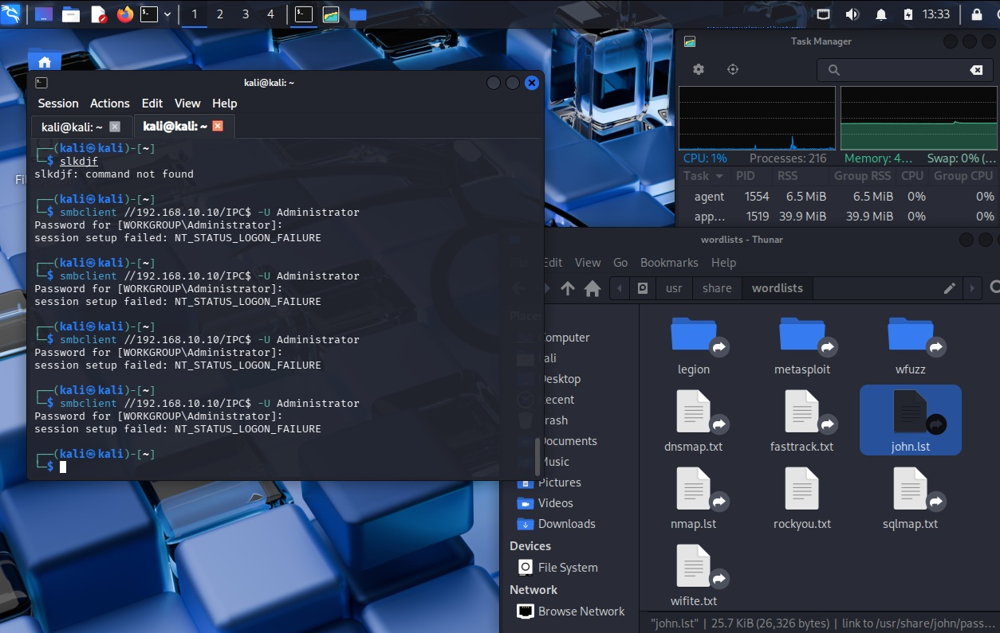
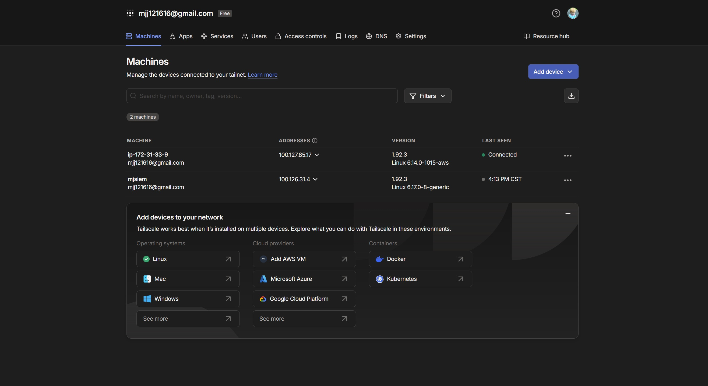
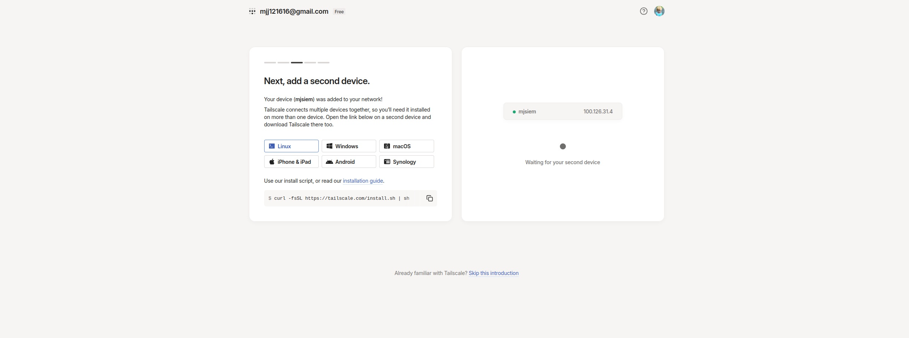

# 🛡️ Hybrid Cloud SIEM Lab - Complete Security Infrastructure

> **A comprehensive home lab project demonstrating enterprise-grade security monitoring, network segmentation, and threat detection across hybrid cloud environments.**

[](https://opensource.org/licenses/MIT)
[]()
[](https://linkedin.com/in/mjajones)

---

## 📌 Executive Summary (LinkedIn-Ready)

**Project:** Hybrid Cloud SIEM with Wazuh & AWS  
**Duration:** Multi-phase security infrastructure deployment  
**Technologies:** Wazuh SIEM, AWS EC2, OPNsense, Active Directory, Tailscale VPN, Kali Linux

**What I Built:**
- Deployed enterprise SIEM (Wazuh) monitoring hybrid cloud infrastructure
- Configured Windows Active Directory Domain with Group Policy Objects
- Implemented network segmentation with OPNsense firewall and IDS/IPS
- Established secure cloud-to-on-premise connectivity via Tailscale VPN
- Simulated and detected real-world attacks (brute force, network scans, malware)

**Key Achievements:**
- ✅ Recovered SIEM from critical disk failure (98% capacity crash)
- ✅ Resolved log ingestion issues between AWS Ubuntu and on-premise SIEM
- ✅ Created custom detection rules for reverse shell attacks
- ✅ Successfully detected and analyzed security incidents in real-time

**Skills Demonstrated:** SIEM Management, Hybrid Cloud Security, Network Segmentation, Active Directory, Incident Response, Disaster Recovery, Threat Detection, Log Analysis

---

---

## 📋 Table of Contents

- [Project Overview](#project-overview)
- [Architecture](#architecture)
- [Project Phases](#project-phases)
- [Technical Challenges & Solutions](#technical-challenges--solutions)
- [Key Learnings](#key-learnings)
- [Technologies Used](#technologies-used)
- [Screenshots & Documentation](#screenshots--documentation)
- [Portfolio Value](#portfolio-value)

---

## 🎯 Project Overview

I designed and deployed a **Hybrid Cloud Security Information and Event Management (SIEM)** system to monitor security threats across disparate network environments. This project bridges a cloud-based production server (AWS) with an on-premise management cluster (VMware) using a secure mesh network (Tailscale), simulating a real-world "Work from Home" IT infrastructure.

### 🏆 Portfolio Highlights


*Complete hybrid cloud SIEM architecture with active agents monitoring Windows Server, AWS EC2, and network infrastructure*


*Real-time security event monitoring and threat detection dashboard*


*Enterprise-grade network security with OPNsense firewall and IDS/IPS*

### Objectives Achieved

✅ **Active Directory Domain Services** - Windows Server 2019/2022 Domain Controller  
✅ **Network Segmentation** - OPNsense firewall with VLANs and DMZ  
✅ **SIEM Deployment** - Wazuh for centralized log management and threat detection  
✅ **Hybrid Cloud Integration** - AWS EC2 connected via Tailscale VPN  
✅ **Attack Simulation** - Kali Linux penetration testing and detection  
✅ **Cloud Security** - AWS CloudTrail monitoring and security groups  

---

## 🏗️ Architecture

### Network Diagram

```
┌─────────────────────────────────────────────────────────────────┐
│                    ☁️ AWS Cloud Environment                      │
│  ┌──────────────────────────────────────────────────────────┐   │
│  │  Ubuntu Server (EC2)                                     │   │
│  │  - Wazuh Agent                                           │   │
│  │  - Target System                                         │   │
│  └──────────────────────────────────────────────────────────┘   │
└───────────────────────┬─────────────────────────────────────────┘
                        │
                        │ Tailscale VPN (Zero-Trust Mesh)
                        │
┌───────────────────────┴─────────────────────────────────────────┐
│              🏠 Home Lab (VMware Virtualization)                 │
│  ┌──────────────────────────────────────────────────────────┐   │
│  │  OPNsense Firewall                                        │   │
│  │  - VLAN Segmentation                                      │   │
│  │  - IDS/IPS (Suricata)                                    │   │
│  │  - DMZ Configuration                                     │   │
│  └──────────────────────────────────────────────────────────┘   │
│                                                                   │
│  ┌──────────────────────────────────────────────────────────┐   │
│  │  Windows Server 2022 (Domain Controller)                  │   │
│  │  - Active Directory                                      │   │
│  │  - Group Policy Objects                                  │   │
│  │  - Wazuh Agent + Sysmon                                  │   │
│  └──────────────────────────────────────────────────────────┘   │
│                                                                   │
│  ┌──────────────────────────────────────────────────────────┐   │
│  │  Wazuh Manager & Indexer                                  │   │
│  │  - Log Aggregation                                        │   │
│  │  - Threat Detection Rules                                 │   │
│  │  - Security Dashboards                                    │   │
│  └──────────────────────────────────────────────────────────┘   │
│                                                                   │
│  ┌──────────────────────────────────────────────────────────┐   │
│  │  Kali Linux (Attack Simulation)                           │   │
│  │  - Penetration Testing                                    │   │
│  │  - Vulnerability Scanning                                 │   │
│  └──────────────────────────────────────────────────────────┘   │
└───────────────────────────────────────────────────────────────────┘
```


**Architecture Diagram:** Complete hybrid cloud SIEM architecture showing AWS EC2 endpoint connected via Tailscale VPN to on-premise Wazuh Manager, Windows Domain Controller, OPNsense firewall, and Kali Linux attack simulation environment.

---

## 🚀 Project Phases

### **PHASE 1 — Networking & Windows Domain (Core Security Foundation)**

Built the foundational Active Directory infrastructure and Windows domain environment.

#### Skills Gained
- Active Directory Domain Services (AD DS)
- User and group management
- Group Policy Object (GPO) creation and deployment
- Windows Event Log analysis
- DNS & DHCP configuration
- Network protocols: RDP, SSH, SMB, Kerberos
- Windows security hardening

#### Tasks Completed
- ✅ Promoted Windows Server 2022 to Domain Controller
- ✅ Created domain users: `michael.admin`, `user1`, `user2`
- ✅ Joined Windows 10/11 client to domain
- ✅ Configured GPOs:
  - Password complexity policy
  - Screensaver lock policy
  - Guest account disabled
  - Unsigned driver blocking
- ✅ Configured network shares and RDP access

**Screenshots:**


*Initial network architecture for Windows Domain environment*


*Account lockout policy configuration via Group Policy*


*Network share folder access testing*


*Remote Desktop Protocol (RDP) connectivity validation*

---

### **PHASE 2 — Firewall & Network Segmentation**

Implemented enterprise-grade network security with OPNsense firewall and IDS/IPS capabilities.

#### Skills Learned
- VLAN configuration and segmentation
- Network Address Translation (NAT)
- Firewall rule creation and management
- Intrusion Detection System (IDS) / Intrusion Prevention System (IPS)
- Suricata rule configuration
- Network traffic logging and analysis

#### Tasks Completed
- ✅ Deployed OPNsense firewall VM
- ✅ Created LAN + DMZ network segmentation
- ✅ Configured firewall rules:
  - Blocked ping from LAN → Domain Controller
  - Allowed ping from LAN → Ubuntu (DMZ)
  - Implemented default deny policies
- ✅ Enabled Suricata IDS/IPS
- ✅ Generated and analyzed IDS alerts using Nmap scans

**Screenshots:**


*OPNsense firewall dashboard showing network traffic and system status*


*Custom firewall rules implementing network segmentation and security policies*


*Intrusion Detection System (Suricata) configuration and monitoring*


*DMZ network segment configuration for Ubuntu server isolation*


*IDS alert: Network scan detection and analysis*

---

### **PHASE 3 — SIEM Deployment (Wazuh)**

Deployed and configured Wazuh SIEM for centralized security monitoring and log analysis.

#### Skills Learned
- SIEM architecture and deployment
- Log ingestion from Windows and Linux systems
- Sysmon configuration for advanced Windows logging
- Custom detection rule creation
- Security alert analysis and triage
- Incident response workflow
- Dashboard creation and visualization

#### Tasks Completed
- ✅ Installed Wazuh Manager & Indexer on VMware VM
- ✅ Installed Sysmon on Windows machines
- ✅ Configured Wazuh agents on:
  - Windows Server 2022 (Domain Controller)
  - Ubuntu Linux (AWS EC2)
- ✅ Forwarded logs to Wazuh SIEM
- ✅ Generated and analyzed security events:
  - Failed login attempts (brute force simulation)
  - USB device insertion detection
  - RDP login success/failure
  - PowerShell suspicious command execution
- ✅ Created custom detection rules for reverse shells
- ✅ Analyzed alerts and generated incident reports

**Screenshots:**


*Wazuh SIEM installation and initial configuration*


*Wazuh main dashboard showing agent status and system overview*


*Real-time security events dashboard with threat detection metrics*


*Brute force attack detection: Multiple failed login attempts identified*


*Custom detection rule for reverse shell detection and alerting*


*Comprehensive security assessment and compliance monitoring*


*Sysmon (System Monitor) installation for advanced Windows event logging*

---

### **PHASE 4 — Attack Lab (Offensive Security)**

Simulated real-world attacks to understand attacker behavior and validate detection capabilities.

#### Skills Learned
- Vulnerability scanning (Nmap, Nikto)
- Metasploit framework usage
- Brute force attack techniques
- Reverse shell exploitation
- Attack vector analysis
- Detection rule validation
- Incident response to active attacks

#### Tasks Completed
- ✅ Deployed Kali Linux attack machine
- ✅ Performed network reconnaissance with Nmap
- ✅ Executed SSH brute force attacks
- ✅ Tested detection capabilities in real-time
- ✅ Captured attack artifacts in SIEM logs
- ✅ Generated incident response reports

**Screenshots:**


*Kali Linux attack simulation: Brute force login attempts against Windows Server*


*Network reconnaissance and vulnerability scanning activities*


*Malware detection test: EICAR test file download from DMZ to server*

---

### **PHASE 5 — Cloud Security Integration**

Extended the lab to include cloud security monitoring and hybrid cloud architecture.

#### Skills Learned
- AWS EC2 instance deployment
- Security Group configuration
- CloudTrail log analysis
- Hybrid cloud networking
- Zero-trust VPN (Tailscale)
- Cloud-to-on-premise log forwarding

#### Tasks Completed
- ✅ Created Ubuntu VM on AWS EC2
- ✅ Configured Security Groups (firewall rules)
- ✅ Enabled CloudTrail for API monitoring
- ✅ Established Tailscale VPN connection
- ✅ Connected cloud agent to on-premise SIEM
- ✅ Validated log ingestion from cloud endpoint

**Screenshots:**


*AWS EC2 Ubuntu server instance configuration and deployment*


*AWS CloudTrail API logging and management event monitoring*


*Tailscale VPN configuration on AWS EC2 instance*


*Secure hybrid cloud connection established via Tailscale mesh VPN*


*Wazuh cloud security audit report (PDF)*

---

### **PHASE 6 — Portfolio Documentation**

Organized all project artifacts, screenshots, and documentation for professional presentation.

---

## 🔧 Technical Challenges & Solutions

This section demonstrates real-world troubleshooting and problem-solving skills—the "engineering scars" that show practical experience. These challenges showcase critical thinking, system administration expertise, and the ability to recover from production failures.

### **Challenge 1: The "Blind Agent" (Log Incompatibility)**

**Issue:**  
The AWS Ubuntu instance utilized `systemd-journald` for logging, but the Wazuh agent defaults to reading flat text files (`/var/log/syslog`), resulting in zero data ingestion from the cloud endpoint.

**Root Cause:**  
Modern Ubuntu systems use binary journald logs instead of traditional text-based syslog files. The Wazuh agent couldn't find the expected log files.

**Solution:**  
Reconfigured the agent's `ossec.conf` to tap directly into the journald socket using the `<localfile>` directive with `log_format="journald"`, bypassing the missing text files and restoring full visibility.

```xml
<localfile>
  <log_format>journald</log_format>
  <location>/var/log/journal</location>
</localfile>
```

**Impact:**  
Successfully restored log ingestion from the cloud endpoint, enabling complete hybrid cloud monitoring.

**Key Takeaway:** Understanding log formats and SIEM agent configuration is critical for hybrid cloud deployments where different operating systems use different logging mechanisms.

---

### **Challenge 2: Catastrophic Disk Failure & Database Deadlock**

**Issue:**  
During high-volume log ingestion, the on-premise VMware VM disk hit 98% capacity. This triggered a "JVM Ergonomics" crash in the Wazuh Indexer (Elasticsearch database), as Java could not allocate memory without available disk space for temporary files.

**Symptoms:**
- Wazuh Indexer service crashed
- Database corruption warnings
- Log ingestion stopped
- System became unresponsive

**Solution (Emergency Recovery):**

1. **Immediate Triage:**
   ```bash
   # Check disk usage
   df -h
   # Found /var/ossec/queue/ consuming excessive space
   ```

2. **Emergency Log Rotation:**
   ```bash
   # Clear queue to break deadlock
   rm -rf /var/ossec/queue/*
   ```

3. **Disk Expansion:**
   ```bash
   # Expand VMware virtual disk (via vSphere/VMware Workstation)
   # Then extend partition live:
   growpart /dev/sda 1
   resize2fs /dev/sda1
   ```

4. **Service Recovery:**
   ```bash
   # Rebuild corrupted directories
   mkdir -p /var/ossec/queue/{alerts,archives,rootcheck,syscheck}
   chown -R wazuh:wazuh /var/ossec/
   systemctl restart wazuh-indexer
   ```

**Impact:**  
Successfully recovered the SIEM from a critical failure state without data loss, demonstrating disaster recovery capabilities.

**Key Takeaway:** Proper capacity planning and log rotation strategies are essential for SIEM deployments. This incident reinforced the importance of monitoring disk usage and implementing automated log management policies.

---

### **Challenge 3: Virtualization Hardware Conflicts**

**Issue:**  
The Kali Linux attack machine suffered from pointer integration failures—the mouse cursor would not properly interact with the VM interface due to VMware 3D acceleration conflicts.

**Solution:**  
Diagnosed the `.vmx` configuration file and manually injected hardware cursor rendering parameters:

```vmx
mouse.vusb.enable = "TRUE"
usb.generic.allowHID = "TRUE"
```

**Impact:**  
Restored full functionality to the attack simulation environment, enabling effective penetration testing.

**Key Takeaway:** Virtualization platform configuration requires deep understanding of hardware abstraction layers. Troubleshooting VM hardware conflicts often requires direct configuration file manipulation.

---

## 📚 Key Learnings

### **Disaster Recovery & System Administration**
- How to recover a Linux database service from a "Disk Full" crash state
- Live partition expansion without downtime
- Service recovery and log directory reconstruction
- File permission management in enterprise environments

### **Hybrid Cloud Networking**
- Zero-trust VPN architecture with Tailscale
- Secure tunneling between cloud and on-premise networks
- Avoiding insecure public IP forwarding
- Mesh networking for distributed security infrastructure

### **Log Pipeline Management**
- Understanding binary logs (Journald) vs. standard text logs
- Log format conversion and parsing
- SIEM log ingestion optimization
- Queue management and rotation strategies

### **Security Operations**
- Real-time threat detection and alerting
- Custom detection rule development
- Incident response workflow
- Attack simulation and validation

### **Network Security**
- Firewall rule design and implementation
- IDS/IPS configuration and tuning
- Network segmentation best practices
- DMZ architecture and security

---

## 🛠️ Technologies Used

### **Infrastructure**
- **VMware Workstation/ESXi** - Virtualization platform
- **Windows Server 2022** - Domain Controller
- **Ubuntu 24.04 LTS** - Linux endpoints (on-premise & AWS)
- **OPNsense** - Firewall and network security
- **Tailscale** - Zero-trust VPN mesh network

### **Security Tools**
- **Wazuh** - SIEM, XDR, and compliance monitoring
- **Sysmon** - Advanced Windows event logging
- **Suricata** - IDS/IPS engine
- **Kali Linux** - Penetration testing platform
- **Metasploit** - Exploitation framework
- **Nmap** - Network scanning and enumeration

### **Cloud Services**
- **Amazon Web Services (AWS)**
  - EC2 (Elastic Compute Cloud)
  - CloudTrail (API logging and monitoring)
  - Security Groups (cloud firewall)

### **Protocols & Standards**
- Active Directory (Kerberos, LDAP)
- RDP, SSH, SMB
- DNS, DHCP
- VPN (WireGuard via Tailscale)

---

## 📸 Screenshots & Documentation

All project screenshots and documentation are organized in the [`images/`](images/) directory:

```
images/
├── Amazon AWS/              # Cloud infrastructure screenshots
├── CLOUD/                   # Hybrid cloud architecture & Tailscale setup
├── Firewall Setup - OPNsense/  # Network security configuration
├── Intrusion Detection Details/ # IDS/IPS alerts and detections
├── KALI/                    # Attack simulation screenshots
├── SIEM - WAZUH/           # Wazuh SIEM dashboards and alerts
├── Sysmon/                 # Windows advanced logging setup
└── Windows Server Setup + VM + GPO/  # Active Directory configuration
```

### **Portfolio Showcase Gallery**

<div align="center">

#### 🏗️ Architecture & Infrastructure


*Complete hybrid cloud SIEM architecture*


*Phase 1: Windows Domain network architecture*

#### 🛡️ Security Monitoring & Detection


*Real-time security event monitoring*


*Network security and traffic monitoring*


*IDS detecting network reconnaissance*

#### ☁️ Cloud Integration


*Secure AWS-to-on-premise VPN connection*


*AWS CloudTrail API monitoring*

</div>

---

## 💼 Portfolio Value

This project demonstrates proficiency in:

✅ **Enterprise Security Architecture** - SIEM deployment and management  
✅ **Hybrid Cloud Security** - Cloud-to-on-premise security integration  
✅ **Network Security** - Firewall configuration, IDS/IPS, segmentation  
✅ **Active Directory** - Domain services, GPOs, Windows security  
✅ **Incident Response** - Threat detection, alerting, and analysis  
✅ **Troubleshooting** - Critical system recovery and problem-solving  
✅ **Documentation** - Professional project documentation and reporting

### 🎯 Why This Project Stands Out

1. **Real-World Scenarios:** Addresses actual production challenges (disk failures, log incompatibilities, hardware conflicts)
2. **End-to-End Implementation:** Covers everything from infrastructure setup to attack detection
3. **Hybrid Cloud Focus:** Demonstrates modern security architecture connecting cloud and on-premise
4. **Troubleshooting Excellence:** Shows ability to recover from critical system failures
5. **Comprehensive Documentation:** Professional-grade documentation suitable for portfolio presentation  

### **Resume Keywords Covered**
- SIEM (Security Information and Event Management)
- XDR (Extended Detection and Response)
- Active Directory
- Network Segmentation
- IDS/IPS
- Cloud Security (AWS)
- Zero-Trust Networking
- Incident Response
- Threat Detection
- Log Analysis
- Vulnerability Assessment
- Penetration Testing

---

## 📝 License

This project is for educational and portfolio purposes. All technologies and tools used are either open-source or used within their respective evaluation/free-tier licenses.

---

## 🔗 Links & Resources

- **Wazuh Documentation:** https://documentation.wazuh.com/
- **OPNsense Documentation:** https://docs.opnsense.org/
- **Tailscale Documentation:** https://tailscale.com/kb/
- **AWS Security Best Practices:** https://aws.amazon.com/security/

---

## 👤 Author

**Michael Jones**  
LinkedIn: [mjajones](https://linkedin.com/in/mjajones)  
GitHub: [mjajones](https://github.com/mjajones)

---

*This project represents a comprehensive home lab environment designed to simulate real-world enterprise security infrastructure. All configurations, challenges, and solutions documented here reflect actual hands-on experience with enterprise-grade security tools and technologies.*
